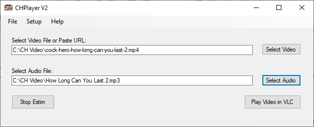

# CHPlayer
CH Player start VLC with selected Audio files

Download and unzip zip file and run setup.exe

Audio files is normaly mp3 e-stim files that match the video files loaded.

You can also just select a Video file or URL for video and then load your audio e-stim file.

And you can read more about this in https://milovana.com/forum/

Remember, you have to install VLC Player before you can use this software. https://www.videolan.org/

# CHPlayer V2
Download and unzip zip file and run setup.exe

Audio files is normaly mp3 e-stim files that match the video files loaded.

You can also just select a Video file or URL for video and then load your audio e-stim file.

Then the E-Stim Audio will play on second Adio Card. Eks. an extra External USB Audio Adapter.

You can select the second Audio Sound Device in the program. 

And you can read more about this in https://milovana.com/forum/

Remember, you have to install VLC Player before you can use this software. https://www.videolan.org/

